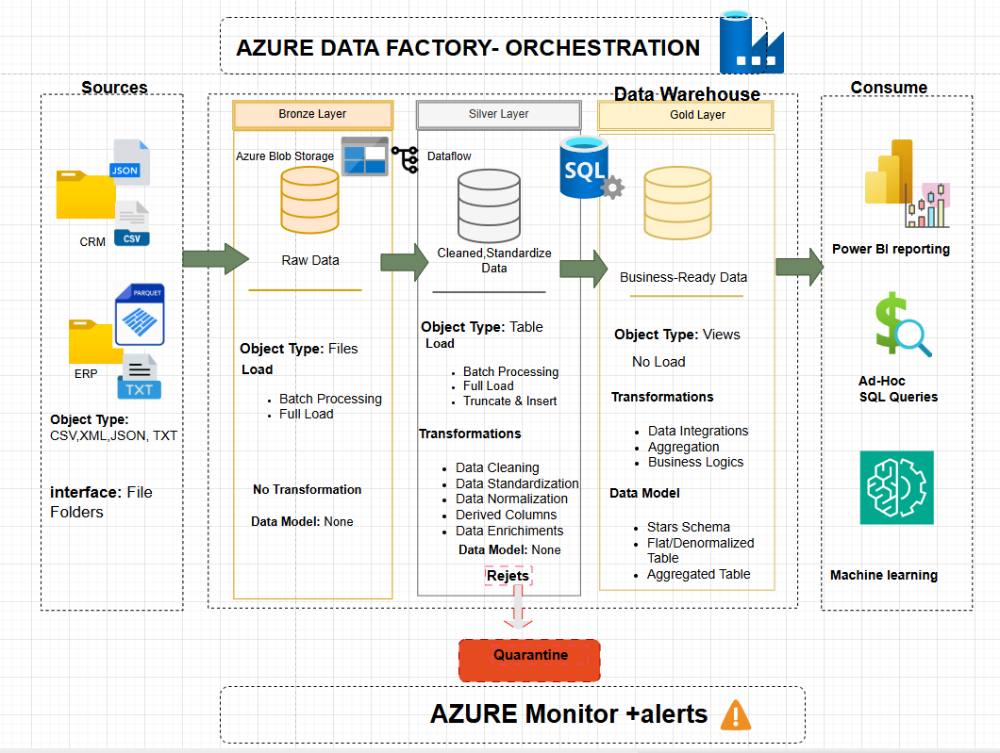

# DAF_Pipeline_01
# 📊 Data Warehouse – Architecture Bronze / Silver / Gold
### Poultry Meat Production – Groupe LDC Style
> Auteur : **Jean-Yves KPANGBAN** | Data Analyst & Pipeline Engineer
> Stack : Azure Data Factory · Azure SQL Server · Power BI · Python · GitHub
> Données : 35 000 lignes · 35 colonnes · 4 sources (CSV, JSON, Parquet, TXT)
 
---
 
## 🚀 Objectif du projet
 
Concevoir un **Data Warehouse centralisé** alimentant les infocentres décisionnels à partir de sources hétérogènes CRM et ERP dans un contexte agroalimentaire industriel (production de volaille).
 
| Ambition | Détail |
|---|---|
| Automatisation | Pipelines ETL/ELT sans intervention manuelle |
| Qualité données | Taux de conformité HACCP > 97%, zéro doublon en Gold |
| Performance | Réduction du temps de traitement de 20h à 3h (objectif -80%) |
| Pilotage métier | Dashboards Power BI mis à jour quotidiennement à 07:00 |
| Traçabilité | Remontée lot_id de la source à la livraison en < 2h |
 
---
 
## 🧭 Contexte métier
 
Les données proviennent de **5 sites de production** (Pays de la Loire / Bretagne) et de **2 systèmes sources** :
 
| Système | Format | Fréquence | Volume estimé |
|---|---|---|---|
| CRM (clients, commandes) | CSV · JSON | Quotidien | ~3 000 lignes/jour |
| ERP SAP (production, stocks) | Parquet · TXT pipe-delimited | Quotidien | ~5 000 lignes/jour |
 
**Espèces traitées :** Poulet (55%), Dinde (25%), Canard (15%), Pintade (5%)
**Certifications gérées :** Label Rouge, Bio AB, IGP Loué, Halal, Kosher, Standard
 
---
 
## 🏗️ Architecture globale

  

 

## ⚙️ Stack technique
 
| Composant | Outil | Usage |
|---|---|---|
| Orchestration | Azure Data Factory | Pipelines, triggers, monitoring |
| Stockage brut | Azure Data Lake / Blob Storage | Bronze layer |
| Transformation | Python (pandas, pyarrow) + SQL | Silver layer |
| Data Warehouse | Azure SQL Server | Gold layer (Star Schema) |
| Calcul distribué | Azure Databricks (optionnel) | Gros volumes, ML |
| Visualisation | Power BI | Dashboards décisionnels |
| Versioning | GitHub | CI/CD pipelines |
| Gestion projet | JIRA | Suivi tâches et sprints |
| Tests qualité | pytest + Great Expectations | Validation données |
 
---
 
## 🧱 Architecture Médaillon
 
### 🥉 Bronze Layer – Ingestion brute
 
**Objectif :** Stocker les données dans leur état d'origine, sans aucune modification. Garantir la traçabilité et permettre le replay en cas d'erreur.
 
